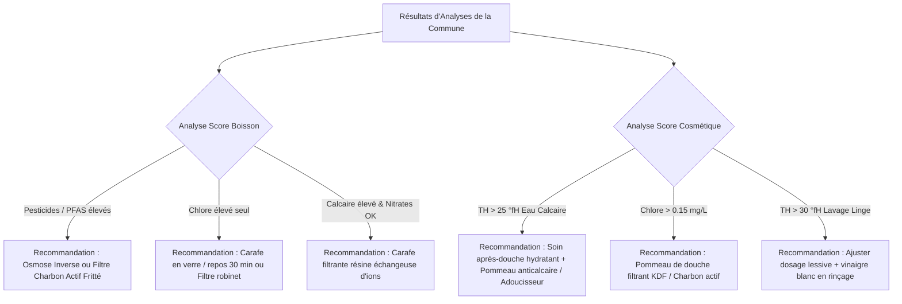

# Spécification Technique & Fonctionnelle — Quali'eau

> **Version :** 1.5.0 (correctif P_métaux : suppression de la RQ non documentée pour Pb/As/Cd/Ni — 05/08/2026)
> **Statut :** En cours de cadrage — spécification de référence
> **Projet :** Quali'eau (même squelette technique que *SCA Water Map* et *Pesticides Water Map*)
> **Sources de données :** Exports data.gouv.fr du contrôle sanitaire SISE-EAUX (batch hebdomadaire) ; API Hub'eau *Qualité de l'eau potable* (développement & tests)

---

## 1. Contexte, Vision & Objectifs

### 1.1 Contexte & Origine
En France, l'eau du robinet est l'aliment le plus contrôlé. Néanmoins, l'accès aux résultats d'analyses sanitaires (publiés par les ARS via la base SISE-EAUX) reste complexe et peu digeste pour le grand public.
Les deux projets précurseurs ont démontré deux besoins complémentaires :
1. **Pesticides Water Map** : cartographier la présence de molécules phytosanitaires, métabolites et polluants émergents (PFAS, nitrates, etc.) pour évaluer la sécurité sanitaire.
2. **SCA Water Map** : analyser les caractéristiques physico-chimiques fines (minéralité TDS, calcium, magnésium, alcalinité KH, dureté GH, pH) selon les standards de la *Specialty Coffee Association* pour la dégustation et l'extraction.

**Quali'eau** unifie ces visions en proposant un service grand public et expert d'évaluation de la qualité de l'eau du robinet selon **2 usages distincts de la vie quotidienne** :
* 🥤 **Usage 1 : Boisson & Santé** (consommation quotidienne, goût, hydratation, sécurité sanitaire, compatibilité boissons chaudes / thé / café).
* 🧴 **Usage 2 : Cosmétique & Lavage** (soin de la peau, cuir chevelu, cheveux, agressivité du calcaire/chlore, efficacité des savons et détergents, entretien du linge et électroménager).

```
                      ┌────────────────────────────────────────┐
                      │   SISE-EAUX / data.gouv (exports DIS)  │
                      │  - Prélèvements & résultats d'analyses │
                      │  - Conclusions sanitaires ARS          │
                      └──────────────────┬─────────────────────┘
                                         │ batch hebdomadaire
                                         ▼
                      ┌────────────────────────────────────────┐
                      │       Moteur de Calcul Quali'eau       │
                      │   - Agrégation temporelle & spatiale   │
                      │   - Normalisation & seuils sanitaires  │
                      └──────────────┬──────────────────┬──────┘
                                     │                  │
                ┌────────────────────┴─────┐      ┌─────┴────────────────────┐
                │                          │      │                          │
                ▼                          ▼      ▼                          ▼
   ┌──────────────────────────┐               ┌──────────────────────────┐
   │    SCORE BOISSON (🥤)     │               │ SCORE COSMÉTIQUE/LAVAGE (🧴)
   │  - Sécurité Sanitaire    │               │  - Calcaire & Dureté TH  │
   │  - Minéralité & Équilibre│               │  - Chlore & Irritation   │
   │  - Profil Goût & Saveur  │               │  - Respect pH Cutané     │
   │  - Indice Café/Thé (SCA) │               │  - Métaux & Dépôts       │
   └──────────────────────────┘               └──────────────────────────┘
```

---

## 2. Architecture des Données & Sources

### 2.1 Source de production : exports data.gouv (batch hebdomadaire)

Comme *Pesticides Water Map*, l'intake de production repose sur les exports officiels du Ministère de la Santé publiés sur data.gouv.fr : [*Résultats du contrôle sanitaire de l'eau distribuée commune par commune*](https://www.data.gouv.fr/fr/datasets/resultats-du-controle-sanitaire-de-leau-distribuee-commune-par-commune/) — mise à jour **hebdomadaire (lundi)**, ce qui fixe la cadence de rafraîchissement du site.

Format réel des fichiers (vérifié le 05/08/2026 directement sur `dis-2026.zip` téléchargé par le projet précurseur *Pesticides Water Map*, 97 872 prélèvements / 3,8 M résultats pour la seule année 2026) :
* Un ZIP par année (~900 Mo au total pour 4 années) contenant **3 fichiers `.txt`**, séparateur virgule, encodage UTF-8, champs entre guillemets.
* **`DIS_PLV_*.txt`** (prélèvements) — colonnes réelles : `cddept, cdreseau, inseecommuneprinc, nomcommuneprinc, cdreseauamont, nomreseauamont, pourcentdebit, referenceprel, dateprel, heureprel, conclusionprel, ugelib, distrlib, moalib, plvconformitebacterio, plvconformitechimique, plvconformitereferencebact, plvconformitereferencechim`. Les 4 champs de conformité valent `C`/`N` (équivalents batch des champs API `conformite_limites_bact_prelevement` etc. de l'§2.2 — noms différents, même sémantique).
* **`DIS_RESULT_*.txt`** (résultats) — colonnes réelles : `cddept, referenceprel, cdparametresiseeaux, cdparametre, libmajparametre, libminparametre, libwebparametre, qualitparam, insituana, rqana, cdunitereferencesiseeaux, cdunitereference, limitequal, refqual, valtraduite, casparam, referenceanl`.
* **`DIS_COM_UDI_*.txt`** (référentiel commune ↔ réseau, non exploité par *Pesticides Water Map* mais nécessaire ici pour §2.5.4) — colonnes réelles : `inseecommune, nomcommune, quartier, cdreseau, nomreseau, debutalim`.
* **Jointure** `DIS_PLV` ↔ `DIS_RESULT` via `referenceprel`.

> **Piège vérifié sur données réelles — lecture de la limite de quantification (LQ) :** contrairement à l'API Hub'eau (§2.2, où `resultat_numerique` porte la valeur de LQ quand le résultat est sous LQ), dans les fichiers batch **`valtraduite` vaut `0.000000` pour toute ligne sous LQ**, quel que soit le paramètre — vérifié sur 4 codes distincts (nitrites `1339`, PFAS `8847`, plomb `1382`, glyphosate `1506`), toujours avec le même motif :
> ```
> "1382","PLOMB",...,"rqana"="<2","limitequal"="<=10 µg/L",...,"valtraduite"="0.000000"
> ```
> La valeur de LQ réelle (ici `2`) et le signe `<` sont **uniquement** dans `rqana` (chaîne, séparateur décimal **virgule** — `"<0,020"`, `"<0,01"` — à convertir en point avant `float()`). Le moteur d'ingestion doit donc détecter le dépassement/sous-LQ et extraire la valeur de LQ depuis `rqana` (`str.startswith("<")` puis remplacement `,`→`.`), **jamais** depuis `valtraduite` seul — l'utiliser naïvement zérairait à tort les substitutions LQ/2 de §2.5.3. Quand `rqana` ne commence pas par `<` (résultat quantifié), `valtraduite` porte la même valeur que `rqana` (converti en point), les deux sont alors interchangeables.

Années retenues : glissantes, couvrant ≥ 24 mois (fenêtre de calcul §2.3).

### 2.2 Source de développement & tests : API Hub'eau

L'API Hub'eau *Qualité de l'eau potable* (v1) reste utilisée en développement pour les tests ciblés et la validation des codes (jamais en boucle nationale — fair-use) :

1. **Résolution Territoire / Réseau (UDI)** :
   `GET https://hubeau.eaufrance.fr/api/v1/qualite_eau_potable/communes_udi`
   *Paramètres :* `code_commune`, `annee`. *Données :* `code_reseau`, `nom_reseau`.

2. **Résultats DIS** :
   `GET https://hubeau.eaufrance.fr/api/v1/qualite_eau_potable/resultats_dis`
   *Paramètres :* `code_commune`, `date_min_prelevement`, `code_parametre`, `fields`, `size` ≤ 20 000, `page`, `sort=desc`.

**Champs exposés par `resultats_dis`** (vérifié sur l'API le 04/08/2026) :

| Champ | Rôle |
| :--- | :--- |
| `code_parametre`, `libelle_parametre`, `code_parametre_se`, `code_parametre_cas` | Identification du paramètre (le code CAS est utile pour les molécules) |
| `resultat_numerique`, `resultat_alphanumerique`, `libelle_unite`, `code_unite` | Valeur mesurée ; `resultat_alphanumerique` commence par `<` quand le résultat est sous la limite de quantification |
| `limite_qualite_parametre`, `reference_qualite_parametre` | Seuils réglementaires textuels (ex : `<=2 mg(Cu)/L`) |
| `date_prelevement`, `code_prelevement`, `reference_analyse` | Traçabilité du prélèvement |
| `conformite_limites_bact_prelevement`, `conformite_limites_pc_prelevement`, `conformite_references_bact_prelevement`, `conformite_references_pc_prelevement` | **Conclusions sanitaires officielles** (`C`/`N`) — utilisées pour le sous-score bactériologie |
| `conclusion_conformite_prelevement` | Conclusion textuelle officielle |
| `reseaux` | Réseaux concernés (`code`, `nom`, `debit`) |
| `nom_uge`, `nom_distributeur`, `nom_moa`, `code_installation_amont`, `nom_installation_amont` | Acteurs de la distribution |

> **Note :** certaines lignes n'ont pas de `code_parametre` (lignes de conclusion / résiduels) — ignorées par le moteur de scoring. Les équivalents existent dans les TXT data.gouv (mêmes champs SISE-EAUX).

### 2.3 Référentiel des Paramètres et Codes SANDRE

Codes **vérifiés par interrogation directe de l'API Hub'eau** (commune test 34116 Grabels, 12 872 analyses, le 04/08/2026) :

| Catégorie | Code SANDRE | Libellé Paramètre | Unité usuelle | Impact Boisson | Impact Cosmétique/Lavage |
| :--- | :--- | :--- | :--- | :--- | :--- |
| **Dureté & Minéraux** | `1345` | Titre hydrotimétrique (TH) | °fH | Minéralité, goût | **Majeur** (calcaire, dessèchement cutané, tartre) |
| | `1374` | Calcium | mg(Ca)/L | Équilibre goût / extraction SCA | Dépôts calcaires, mousse savon |
| | `1372` | Magnésium | mg(Mg)/L | Goût, santé cardiovasculaire | Dureté totale |
| | `1347` | Titre alcalimétrique complet (TAC) | °fH | Pouvoir tampon, acidité café/thé | Entartrage à chaud |
| | `1303` | Conductivité à 25°C | µS/cm | Minéralité globale (TDS estimé) | Résidus de séchage |
| | `1375` | Sodium | mg(Na)/L | Régimes hyposodés, nourrissons | Neutre |
| **Désinfection** | `1398` | Chlore libre | mg(Cl₂)/L | Odeur, altération saveur | **Majeur** (agression kératine, tiraillement) |
| | `1399` | Chlore total | mg(Cl₂)/L | Sous-produits chlorés | Irritation peau & yeux sous la douche |
| | `2036` | Trihalométhanes (4 substances) | µg/L | Cancérogène potentiel | Inhalation sous douche chaude |
| **Physico-chimie** | `1302` | pH | unité pH | Acidité / basicité | **Majeur** (respect film hydrolipidique ~5.5) |
| | `1295` | Turbidité néphélométrique | NFU | Clarté, acceptabilité visuelle | Dépôts matières en suspension |
| | `1309` | Coloration | mg(Pt)/L | Acceptabilité organoleptique | Taches sur le linge clair |
| **Nutriments & Sels** | `1340` | Nitrates (en NO₃) | mg/L | **Majeur** (toxicité nourrissons, LQ 50 mg/L) | Neutre |
| | `1339` | Nitrites (en NO₂) | mg/L | **Majeur** (toxicité hématologique, LQ 0,1 mg/L) | Neutre |
| | `1337` | Chlorures | mg/L | Goût salé, corrosivité | Corrosivité appareils |
| | `1338` | Sulfates | mg/L | Goût amer, effet laxatif si élevé | Neutre |
| **Métaux traces** | `1393` | Fer total | µg/L | Goût métallique | **Majeur** (taches linge, oxydation cheveux) |
| | `1394` | Manganèse total | µg/L | Goût, turbidité brune | Taches noires/brunes sur linge |
| | `1392` | Cuivre | mg(Cu)/L (LQ 2, RQ 1) | Toxicité chronique, goût | Reflets verdâtres cheveux clairs/décolorés |
| | `1382` | Plomb | µg/L | **Critique** (neurotoxique, LQ 10 µg/L) | Faible |
| | `1369` | Arsenic | µg/L | **Critique** (cancérogène, LQ 10 µg/L) | Toxique chronique |
| | `1388` | Cadmium | µg/L | **Critique** (LQ 5 µg/L) | Neutre |
| | `1386` | Nickel | µg/L | Toxicité, allergène (LQ 20 µg/L) | Allergies de contact rares par l'eau |
| **Microbiologie** | `1449` | Escherichia coli /100mL | n/100 mL | **Critique** (pathogène fécal, 0 toléré) | Risque infections plaies/muqueuses |
| | `6455` | Entérocoques /100mL | n/100 mL | **Critique** (contamination fécale) | Risque infections |
| | `1447` | Bactéries coliformes /100mL | n/100 mL | Indicateur d'efficacité réseau | Indicateur bactérien |
| **Micropolluants** | liste §2.4 | Pesticides individuels & métabolites | µg/L | **Critique** (LQ 0,1 µg/L par molécule) | Faible absorption cutanée |
| | `6276` | Total des pesticides analysés | µg/L | **Critique** (LQ 0,5 µg/L total) | Faible absorption cutanée |
| | `8847` | Somme de 20 substances perfluoroalkylées (PFAS) | µg/L | **Critique** (LQ 0,1 µg/L) | Bioaccumulation |
| **Indicateurs officiels** | `6374` | Nitrates/50 + Nitrites/3 | — | Contrôle combiné réglementaire | — |
| **Qualitatif (info)** | `5900` / `5901` / `5902` | Couleur / Odeur / Saveur (qualitatif) | — | Signaux organoleptiques ARS | — |

### 2.4 Molécules pesticides & PFAS

**Pesticides suivis** : liste des 17 codes SANDRE déjà validés sur données réelles par *Pesticides Water Map* (`1107, 1108, 1113, 1129, 1177, 1208, 1209, 1473, 1506, 1667, 1877, 1907, 2974, 6894, 6895, 7717, 8865`), extensible. La somme réglementaire est lue directement via `6276`.

**PFAS individuels** (détail de `8847`) : `5347` (PFOA), `6561` (PFOS), `6830` (PFHxS), `5977`–`5980`, `6025`, `6507`–`6510`, `6542`, `6549`–`6550`, `8738`–`8742`.

### 2.5 Règles d'Échantillonnage, d'Agrégation & Cas Limites

1. **Fenêtre temporelle :** les calculs reposent sur les prélèvements des **12 derniers mois**, étendue à **24 mois** si le réseau a moins de 4 analyses sur 12 mois.
2. **Pondération temporelle :** exponentielle décroissante selon l'ancienneté :
   $$w_i = e^{-\lambda \cdot \Delta t_i} \quad \text{avec } \lambda = \frac{\ln(2)}{180 \text{ jours}} \text{ (demi-vie 180 j)}$$
   La valeur retenue par paramètre est la **moyenne pondérée** des mesures de la fenêtre.
3. **Limites de quantification (LQ) :** quand la valeur brute commence par `<`, la mesure est sous LQ. Règle retenue (scénario de précaution) :
   * **Sommes réglementaires (`6276`, `8847`) — priorité tranchée en v1.3 :** si le champ total est disponible en valeur numérique, il fait foi (valeur officielle déjà agrégée par le laboratoire) ; s'il est absent ou lui-même rapporté `< LQ_total`, recalcul par sommation des molécules individuelles avec substitution **LQ/2** par molécule sous LQ.
   * Paramètres individuels affichés : valeur `< LQ` affichée telle quelle, non pénalisante.
4. **Communes multi-réseaux (UDI) :** une commune peut être desservie par plusieurs réseaux. Règle : un score **par réseau**, réseau principal = celui disposant du plus grand nombre de prélèvements récents ; la fiche JSON expose tous les réseaux et le front propose un sélecteur.
5. **Communes PLM :** Paris (`75056`), Lyon (`69123`), Marseille (`13055`) traitées au niveau commune globale ; les codes arrondissements sont normalisés vers le code parent.
6. **Absence de données :** aucun prélèvement exploitable sur 24 mois ⇒ `statut_donnees: "indisponible"`, `scores: null`, date du dernier prélèvement connu. **Aucune extrapolation** départementale (commune grisée sur la carte).
7. **Estimation TDS :** `TDS (mg/L) ≈ 0,65 × Conductivité (µS/cm)` (coefficient configurable, 0,65 par défaut).
8. **Estimation GH (dureté calcique SCA) si calcium absent :** `GH (mg/L CaCO₃) ≈ TH (°fH) × 10 × 0,65` (proxy validé par *SCA Water Map* : Ca ≈ 65 % de la dureté totale en eau calcaire française).

---

## 3. Algorithmes de Scoring Détaillés

Les deux scores sont normalisés sur une échelle de **0 à 100** (arrondis à l'entier) avec attribution d'une lettre (**A, B, C, D, E**) façon Nutri-Score :

```
Score Global  : [100 ──── 80 ──── 60 ──── 40 ──── 20 ──── 0]
Classe        : [  A   │   B   │   C   │   D   │   E   ]
Signification : [Parfait│ Bon  │Moyen  │Passable│Critique]
```

> Règle générale : toute note intermédiaire est bornée dans [0, 100]. Quand un paramètre requis à un sous-score est absent sur la fenêtre, le sous-score est recalculé **en renormalisant les poids des paramètres disponibles** ; si aucun paramètre du sous-score n'est disponible, le sous-score vaut `null` et le score global est calculé sans lui (renormalisation), avec un indicateur `donnees_partielles: true`.

---

### 3.1 Score Usage 1 : Boisson & Santé ($S_{\text{boisson}}$)

#### Formule Globale :
$$S_{\text{boisson}} = 0.55 \cdot S_{\text{sécurité}} + 0.25 \cdot S_{\text{minéraux}} + 0.20 \cdot S_{\text{goût}}$$

> **Veto sanitaire (facteur limitant) :** si au moins une des conditions suivantes est vraie sur la fenêtre, alors $S_{\text{boisson}} = \min(S_{\text{boisson}}, S_{\text{sécurité}})$ :
> * non-conformité bactériologique **active** (voir $P_{\text{bact}}$) ;
> * nitrates > 50 mg/L ou nitrites > 0,1 mg/L (limite de qualité) — voir $P_{\text{nitrates}}$ ;
> * plomb > 10 µg/L, arsenic > 10 µg/L ou cadmium > 5 µg/L ;
> * une molécule pesticide > 0,1 µg/L ou total pesticides (`6276`) > 0,5 µg/L ;
> * somme des 20 PFAS (`8847`) > 0,1 µg/L.
>
> **Correction v1.3 (bug critique) :** en v1.1/v1.2, $S_{\text{sécurité}} = \min(P_{\text{bact}}, P_{\text{pest}}, P_{\text{pfas}}, P_{\text{métaux}})$ n'incluait ni les nitrates ni les nitrites. Le plafond `min(S_boisson, S_sécurité)` était donc **sans effet réel** sur un dépassement de nitrates/nitrites : une eau à 60 mg/L de nitrates avec bactério/pesticides/PFAS/métaux parfaits (`S_sécurité = 100`) pouvait afficher ~83/100 (classe B) au lieu d'un score dégradé. Correctif : `P_nitrates` rejoint le `min()` de $S_{\text{sécurité}}$ ci-dessous, ce qui rend le veto structurellement opérant.

#### 1. Sous-score Sécurité Sanitaire ($S_{\text{sécurité}} \in [0, 100]$)
$$S_{\text{sécurité}} = \min(P_{\text{bact}}, P_{\text{pest}}, P_{\text{pfas}}, P_{\text{métaux}}, P_{\text{nitrates}})$$

* **Bactériologie ($P_{\text{bact}}$)** — calculée sur les **conclusions officielles** de conformité bactériologique (C/N) et non par ré-évaluation des comptages :
  * Dernier prélèvement bactériologique conforme (`C`) : $100$.
  * Non-conformité (`N`) **résolue** (au moins un prélèvement de contrôle `C` postérieur à la détection) : $50$.
  * Non-conformité **active** (`N` sur le dernier prélèvement, sans contrôle `C` postérieur) : $0$ — *eau présumée impropre à la consommation sans ébullition*.
* **Pesticides & Métabolites ($P_{\text{pest}}$)** — sur la liste §2.4 et le total `6276` :
  * Total < 0,05 µg/L et aucune molécule ≥ 0,05 µg/L : $100$.
  * 0,05 ≤ total ≤ 0,5 µg/L (dans la norme) : note linéaire de $100$ à $70$.
  * Dépassement (total > 0,5 µg/L ou molécule > 0,1 µg/L) : $50 \times \frac{\text{limite}}{\text{valeur}}$, plancher 0.
* **PFAS ($P_{\text{pfas}}$)** — sur `8847` :
  * < 0,02 µg/L : $100$.
  * 0,02 à 0,10 µg/L : note linéaire de $90$ à $60$.
  * > 0,10 µg/L : $60 \times \frac{0{,}10}{\text{valeur}}$, plafonnée à 30.
* **Métaux Lourds & Toxiques ($P_{\text{métaux}}$)** — Pb, As, Cd, Ni évalués contre leur seule limite de qualité (LQ) réglementaire, puis $P_{\text{métaux}} = \min_i(\text{note}_i)$ :
  * $v \le LQ$ : $100$.
  * $v > LQ$ : $70 \times \frac{LQ}{v}$ (plancher 0).
  * *Correction v1.5 :* la v1.0–v1.3 imposait une interpolation à deux paliers RQ→LQ pour ces quatre métaux, mais aucune valeur de RQ n'a jamais été documentée pour eux en §2.3 (contrairement au cuivre, `1392`, qui est un paramètre de confort avec RQ=1/LQ=2 mg/L explicites en §3.2.4) — ces métaux toxiques n'ont pas de « référence de qualité » distincte en droit français, seulement une limite de qualité. Le barème est donc aligné sur le même principe à seuil unique que $P_{\text{pest}}$/$P_{\text{pfas}}$.
* **Nitrates & Nitrites ($P_{\text{nitrates}}$, ajouté en v1.3)** — évalués contre leur limite de qualité réglementaire respective (nitrates `1340` : 50 mg/L ; nitrites `1339` : 0,1 mg/L), indépendamment du barème gustatif $N_{\text{nitrates}}$ de $S_{\text{minéraux}}$ (§3.1.2, qui grade le confort à basse concentration et non le dépassement réglementaire) :
  * nitrates ≤ 50 mg/L **et** nitrites ≤ 0,1 mg/L : $100$.
  * nitrates > 50 mg/L : $50 \times \frac{50}{\text{valeur}}$, plancher 0.
  * nitrites > 0,1 mg/L : $50 \times \frac{0{,}1}{\text{valeur}}$, plancher 0.
  * Si les deux dépassements sont simultanés, $P_{\text{nitrates}} = \min$ des deux notes.

#### 2. Sous-score Minéraux & Équilibre ($S_{\text{minéraux}} \in [0, 100]$)
$$S_{\text{minéraux}} = 0.70 \cdot N_{\text{nitrates}} + 0.15 \cdot N_{\text{chlorures}} + 0.15 \cdot N_{\text{sulfates}}$$

* **Nitrates ($N_{\text{nitrates}}$) :**
  * < 10 mg/L : $100$ (idéal nourrissons et femmes enceintes)
  * 10–25 mg/L : $85$ | 25–40 mg/L : $65$ | 40–50 mg/L : $40$ | > 50 mg/L : $0$ (veto)
* **Nitrites :** pas de sous-note dans $S_{\text{minéraux}}$ (paramètre de sécurité pure, sans gradient gustatif) ; évaluées via $P_{\text{nitrates}}$ dans $S_{\text{sécurité}}$ (§3.1.1) et l'indicateur officiel `6374`.
* **Chlorures ($N_{\text{chlorures}}$) :** ≤ 100 mg/L : $100$ ; décroissance linéaire de $100$ à $40$ entre 100 et 200 mg/L ; $40 \times \frac{200}{v}$ au-delà.
* **Sulfates ($N_{\text{sulfates}}$) :** ≤ 150 mg/L : $100$ ; décroissance linéaire de $100$ à $40$ entre 150 et 250 mg/L ; $40 \times \frac{250}{v}$ au-delà.

#### 3. Sous-score Profil Gustatif & Organoleptique ($S_{\text{goût}} \in [0, 100]$)
$$S_{\text{goût}} = 0.60 \cdot N_{\text{chlore}} + 0.40 \cdot N_{\text{turbidité}}$$

* **Chlore libre résiduel ($N_{\text{chlore}}$) :**
  * < 0,05 mg/L : $100$ (aucun goût) | 0,05–0,15 : $80$ | 0,15–0,30 : $50$ | > 0,30 : $20$
* **Turbidité ($N_{\text{turbidité}}$) :**
  * < 0,3 NFU : $100$ | 0,3–1,0 : $80$ | 1,0–2,0 : $55$ | > 2,0 : $30$

#### 4. Indicateur Spécialisé Café / Thé (SCA Standard)
Sous-indice **"Coffee & Tea Index"** calculé en complément (hors score global), sur les cibles SCA :
* **TDS estimé :** cible 150 mg/L, plage acceptable 75–250 mg/L (estimation §2.5.7).
* **Dureté calcique (GH) :** cible 68 mg/L CaCO₃ (~6,8 °fH) — estimation §2.5.8 si calcium absent.
* **Alcalinité totale (KH / TAC `1347`) :** cible 40 mg/L CaCO₃ (~4,0 °fH).
* **Chlore total (`1399`) :** cible 0 mg/L.

---

### 3.2 Score Usage 2 : Cosmétique, Peau & Lavage ($S_{\text{cosmétique}}$)

#### Formule Globale :
$$S_{\text{cosmétique}} = 0.45 \cdot S_{\text{dureté}} + 0.25 \cdot S_{\text{chlore}} + 0.15 \cdot S_{\text{pH}} + 0.15 \cdot S_{\text{métaux\_dépôts}}$$

```
                      Pondération Score Cosmétique & Lavage
                 ┌──────────────────────────────────────────────┐
                 │  ██████████████████████ Dureté (TH)     45%  │
                 │  █████████████ Chlore & Oxydants        25%  │
                 │  ███████ pH & Équilibre Cutané          15%  │
                 │  ███████ Métaux & Dépôts (Fe/Mn/Cu)     15%  │
                 └──────────────────────────────────────────────┘
```

#### 1. Sous-score Dureté & Calcaire ($S_{\text{dureté}} \in [0, 100]$)
Fonction **par paliers en dessous de 15 °fH, continue et normative au-delà** (correction de formulation v1.3 : la v1.1/v1.2 annonçait une continuité totale, inexacte pour TH < 15 où deux sauts discrets subsistent à 3 et 8 °fH) :

$$S_{\text{dureté}}(\text{TH}) =
\begin{cases}
85 & \text{si } \text{TH} < 3 \text{ (eau très adoucie : corrosive, rinçage difficile)} \\
90 & \text{si } 3 \le \text{TH} < 8 \\
100 & \text{si } 8 \le \text{TH} \le 15 \\
100 - 2.5 \cdot (\text{TH} - 15) & \text{si } 15 < \text{TH} \le 25 \\
75 - 3.0 \cdot (\text{TH} - 25) & \text{si } 25 < \text{TH} \le 35 \\
\max(0,\ 45 - 3.0 \cdot (\text{TH} - 35)) & \text{si } \text{TH} > 35
\end{cases}$$

Repères : TH 4 → 90 · TH 10 → 100 · TH 20 → 87,5 · TH 30 → 60 · TH 40 → 30 · TH ≥ 50 → 0.

| Bande TH | Lecture métier |
| :--- | :--- |
| < 3 °fH | Très adoucie : corrosive pour les canalisations, rinçage des savons difficile |
| 3–8 °fH | Très douce : excellente pour la peau |
| 8–15 °fH | Idéale : pas d'entartrage, douceur maximale |
| 15–25 °fH | Moyennement dure : légers tiraillements peaux sensibles, début d'entartrage à chaud |
| 25–35 °fH | Dure : dessèchement, cheveux rêches, dépôts blancs |
| > 35 °fH | Très dure : agression cuir chevelu, surconsommation de produits lavants, entartrage rapide |

#### 2. Sous-score Chlore & Agressivité Oxydante ($S_{\text{chlore}} \in [0, 100]$)
Sous l'eau chaude de la douche, le chlore s'évapore et oxyde les lipides de la couche cornée et la kératine du cheveu (barème identique à $N_{\text{chlore}}$ boisson, appliqué au **chlore total `1399`**) :
* ≤ 0,05 mg/L : $100$ | 0,05–0,15 : $80$ | 0,15–0,30 : $50$ | > 0,30 : $20$

#### 3. Sous-score Respect Cutané & pH ($S_{\text{pH}} \in [0, 100]$)
Le pH cutané physiologique est légèrement acide (~4,7–5,5) ; une eau trop alcaline altère le manteau acide protecteur :
* 6,8 ≤ pH ≤ 7,4 : $100$ (neutre)
* 6,5 ≤ pH < 6,8 : $85$ (légèrement acide, acceptable)
* 7,4 < pH ≤ 7,8 : $80$ | 7,8 < pH ≤ 8,2 : $55$ | pH > 8,2 ou pH < 6,5 : $25$

#### 4. Sous-score Métaux & Taches ($S_{\text{métaux\_dépôts}} \in [0, 100]$)
$$S_{\text{métaux\_dépôts}} = \min(N_{\text{Cu}}, N_{\text{Fe}}, N_{\text{Mn}})$$
* **Cuivre (`1392`) :** < 0,1 mg/L : $100$ ; 0,1–0,5 : interpolation $100 \to 50$ ; > 0,5 mg/L : $30$.
* **Fer total (`1393`) :** < 50 µg/L : $100$ ; 50–200 : interpolation $100 \to 40$ ; > 200 µg/L : $20$.
* **Manganèse (`1394`) :** < 10 µg/L : $100$ ; 10–50 : interpolation $100 \to 40$ ; > 50 µg/L : $20$.

---

## 4. Matrice de Recommandations Personnalisées

En fonction des scores et des paramètres hors cibles, Quali'eau génère des conseils actionnables et impartiaux (aucune promotion de marque). Les recommandations sont **pré-calculées en batch** et stockées dans chaque fiche communale :



| Problème Détecté | Score Impacté | Recommandation Boisson | Recommandation Cosmétique & Maison |
| :--- | :--- | :--- | :--- |
| **TH > 30 °fH (Très Calcaire)** | Cosmétique | Aucun impact néfaste sur la santé. Pour le thé/café : carafe filtrante recommandée. | Savon surgras ou huile de douche ; pommeau filtrant ; 50 ml de vinaigre blanc dans le bac adoucissant du lave-linge. |
| **Chlore > 0,20 mg/L** | Boisson & Cosmétique | Laisser décanter l'eau 30 min au réfrigérateur en carafe ouverte. | Pommeau de douche avec filtre KDF ou billes céramiques. |
| **Nitrates > 25 mg/L** | Boisson | Éviter pour les biberons (< 15 mg/L conseillé). Osmoseur si > 40 mg/L. | Aucun impact cosmétique. |
| **Pesticides / PFAS détectés** | Boisson | Filtration sous évier (bloc charbon actif haute densité ou osmose inverse). | Aucun impact cosmétique significatif. |
| **Fer / Cuivre élevé** | Cosmétique | Laisser couler l'eau 30 s le matin avant consommation. | Masque capillaire chélatant (cheveux blonds) ; lessive sans agents blanchissants agressifs. |
| **Non-conformité bactério active** | Boisson (veto) | Relayer la consigne officielle ARS/préfecture (ébullition ou restriction) — ne jamais minimiser. | Risque sur plaies et muqueuses. |

### 4.1 Estimation Budgétaire par Palier Technologique (ajout v1.3)

L'écart à la norme ne fait pas croître le coût de traitement de façon linéaire : c'est une **progression par paliers de technologies** (le matériel change de catégorie) combinée à un **surcoût de consommables** (l'appareil retenu use plus vite ses réactifs). Cette estimation est **calculée en batch** dans `pipeline/compute_scores.py` (§5.6) et stockée dans le champ `estimation_cout` de chaque recommandation de la fiche communale (§5.3) — jamais interrogée en direct côté client, cohérent avec l'architecture 100 % statique de la v1.2.

#### 4.1.1 Dureté & Calcaire (Usage Douche & Maison) — paramètre `1345` (TH)

Un adoucisseur se dimensionne en litres de résine (capacité d'échange d'ions) ; plus l'eau est dure, plus la résine sature vite et doit régénérer souvent (consommation de sel et d'eau de rinçage) :

| Palier TH (`1345`) | Matériel | Achat (CAPEX) | Entretien annuel (OPEX) |
| :--- | :--- | :--- | :--- |
| 15 – 25 °fH (dur) | Adoucisseur standard 10–15 L | 700 € – 900 € | ~15 €/an (2 sacs de sel) |
| 25 – 40 °fH (très dur) | Adoucisseur renforcé 20–25 L | 1 200 € – 1 600 € | 50 € – 70 €/an (4-5 sacs de sel) |
| > 40 °fH (extrêmement dur) | Adoucisseur haute capacité > 25 L + filtre renforcé | 1 600 € – 2 000 € | 70 € – 100 €/an (8+ sacs de sel) |

Au-delà de 40 °fH, chaque régénération rejette de l'eau à l'égout : la facture d'eau globale du foyer augmente de l'ordre de **5 à 10 %**.

> Les bornes (15, 25, 40 °fH) reprennent les seuils déjà définis pour $S_{\text{dureté}}$ (§3.2.1), pour rester cohérent avec le score affiché plutôt que d'introduire une échelle parallèle.

#### 4.1.2 Polluants Chimiques (Usage Boisson) — paramètres `1340` (nitrates), `1339` (nitrites), `6276` (pesticides), `8847` (PFAS)

Ici, un écart extrême ne change pas seulement le consommable : il **oblige à changer de technologie**, le charbon actif étant inefficace sur les nitrates et peu efficace sur les PFAS à haute concentration.

| Écart à la norme | Technologie requise | Achat (CAPEX) | Entretien annuel (OPEX) |
| :--- | :--- | :--- | :--- |
| **Modéré** — sous 50 % du seuil de veto (ex. pesticide 0,05–0,25 µg/L, nitrates < 25 mg/L) | Filtre sous-évier à charbon actif | 80 € – 120 € | ~30 €/an (1 cartouche) |
| **Élevé** — entre 50 % et 100 % du seuil de veto (ex. nitrates 25–50 mg/L, pesticide total 0,25–0,5 µg/L) | Osmoseur inverse basique (3 étages) | 200 € – 300 € | ~60 €/an (cartouches + membrane) |
| **Extrême / multi-polluants** — seuil de veto atteint (nitrates > 50 mg/L, nitrites > 0,1 mg/L, pesticide total > 0,5 µg/L ou molécule > 0,1 µg/L, PFAS > 0,1 µg/L) | Osmoseur à pompe de perméat + reminéralisation | 450 € – 700 € | ~90 €/an (membrane 0,0001 µm saturée plus vite) |

> Les seuils "Élevé"/"Extrême" réutilisent directement les seuils de veto déjà définis en §3.1 ($P_{\text{pest}}$, $P_{\text{pfas}}$, $P_{\text{nitrates}}$) plutôt qu'une échelle indépendante — un même dépassement doit produire la même sévérité dans le score et dans la recommandation.

**Résumé :** un dépassement génère (1) un **saut de classe de matériel** (filtre charbon → osmoseur basique → osmoseur avancé) et (2) une **usure accélérée des consommables** (sel, cartouches, membrane) qui augmente l'OPEX annuel — deux effets non linéaires, documentés séparément ci-dessus.

---

## 5. Architecture Technique — Site 100 % Statique (GitHub Pages)

> **Décision D1 (tranchée le 04/08/2026) :** Quali'eau adopte le même squelette technique que *SCA Water Map* et *Pesticides Water Map* : **aucun backend, aucune base de données, aucun coût d'hébergement**. Tout est pré-calculé en batch hebdomadaire et servi en fichiers statiques. La fraîcheur hebdomadaire est sans perte réelle puisque la source SISE-EAUX n'est publiée qu'une fois par semaine.

### 5.1 Schéma d'Architecture

```
┌──────────────── GitHub Actions — cron hebdo (lundi, jour de publication DIS) ─────────────┐
│  1. pipeline/download_data.py   → ZIPs DIS data.gouv (~900 Mo, 4 années glissantes)       │
│  2. pipeline/compute_scores.py  → parsing DIS_PLV/DIS_RESULT (jointure referenceprel)     │
│                                   agrégation §2.5 + scoring §3 + recommandations §4       │
│                                   ├→ public/data/national.geojson        (carte)          │
│                                   ├→ public/data/index.json              (métadonnées)    │
│                                   └→ public/data/communes/{code_insee}.json (35k fiches)  │
│  3. peaceiris/actions-gh-pages  → déploiement de public/                                  │
└───────────────────────────────────────────┬───────────────────────────────────────────────┘
                                            │ push branche gh-pages
┌───────────────────────────────────────────▼───────────────────────────────────────────────┐
│                    GITHUB PAGES (hébergement statique + CDN, gzip natif)                  │
│  index.html · map.js · panel.js · style.css  (vanilla JS + MapLibre GL, sans build)       │
│  - Carte nationale  : fetch data/national.geojson (une seule fois, scores + classes)      │
│  - Fiche communale  : fetch data/communes/{code}.json au clic (lazy-loading)              │
│  - Recherche commune : geo.api.gouv.fr appelée directement par le navigateur (CORS ok)    │
│  - Géolocalisation  : GPS navigateur + reverse geocoding geo.api.gouv.fr (client-side)    │
└───────────────────────────────────────────────────────────────────────────────────────────┘
```

### 5.2 Arborescence du Dépôt

```
Quali'eau/
├── pipeline/
│   ├── download_data.py        # télécharge et extrait les ZIPs DIS data.gouv
│   ├── compute_scores.py       # parsing, agrégation, scoring, génération JSON
│   └── requirements.txt
├── tests/                      # pytest : scoring pur + échantillon 50 communes
├── public/                     # racine GitHub Pages
│   ├── index.html  map.js  panel.js  style.css
│   └── data/
│       ├── national.geojson    # ~35k features allégées (scores, classes, TH, nitrates)
│       ├── index.json          # version des données, date de génération, stats nationales
│       └── communes/{code_insee}.json   # fiche complète (schéma §5.3)
├── .github/workflows/update-data.yml
└── SPECIFICATION.md
```

### 5.3 Contrats de Données (fichiers statiques)

#### `data/communes/{code_insee}.json` — fiche communale
Schéma inchangé par rapport à la v1.1 (exemple recalculé, arithmétique vérifiée) :

```json
{
  "commune": {
    "code_insee": "75056",
    "nom": "Paris",
    "departement": "75",
    "population": 2145906
  },
  "reseaux": [
    {
      "code_reseau": "075000221",
      "nom_reseau": "CENTRE",
      "nom_distributeur": "EAU DE PARIS",
      "principal": true,
      "dernier_prelevement_date": "2026-06-15T08:30:00Z",
      "nb_prelevements_12m": 184
    }
  ],
  "statut_donnees": "complet",
  "scores": {
    "boisson": {
      "score": 90,
      "classe": "A",
      "veto_sanitaire": false,
      "appreciation": "Excellente qualité de boisson",
      "sous_scores": {
        "securite_sanitaire": 95,
        "mineraux_equilibre": 85,
        "gout_organoleptique": 80
      },
      "detail_calcul": "0.55×95 + 0.25×85 + 0.20×80 = 89.5 → 90",
      "sca_coffee_index": {
        "score": 72,
        "tds_estime_mg_l": 320,
        "th_f": 30.2,
        "alcalinite_kh_f": 22.0,
        "avis": "Eau dure : filtration recommandée pour extraction espresso et filtre"
      }
    },
    "cosmetique": {
      "score": 76,
      "classe": "B",
      "appreciation": "Eau plutôt calcaire (TH 30 °fH) : tiraillements possibles sur peaux sensibles",
      "sous_scores": {
        "durete_calcaire": 59,
        "chlore_agressivite": 80,
        "respect_ph": 100,
        "metaux_depots": 95
      },
      "detail_calcul": "0.45×59 + 0.25×80 + 0.15×100 + 0.15×95 = 75.8 → 76"
    }
  },
  "indicateurs_cles": [
    {
      "code_parametre": "1345",
      "nom": "Dureté de l'eau (TH)",
      "valeur": 30.19,
      "unite": "°fH",
      "statut": "Calcaire",
      "seuil_ref": "8-15 °fH idéal",
      "impact": "cosmetique"
    },
    {
      "code_parametre": "1340",
      "nom": "Nitrates",
      "valeur": 18.4,
      "unite": "mg/L",
      "statut": "Très bon",
      "seuil_ref": "< 50 mg/L (LQ)",
      "impact": "boisson"
    },
    {
      "code_parametre": "1398",
      "nom": "Chlore libre",
      "valeur": 0.12,
      "unite": "mg/L",
      "statut": "Modéré",
      "seuil_ref": "< 0.15 mg/L",
      "impact": "mixte"
    }
  ],
  "historique": {
    "th_f": [["2025-07", 29.8], ["2025-10", 30.5], ["2026-01", 30.1], ["2026-04", 30.19]],
    "nitrates_mg_l": [["2025-07", 17.9], ["2026-01", 18.4]]
  },
  "recommandations": [
    {
      "usage": "cosmetique",
      "type": "pommeau_filtrant",
      "titre": "Protéger la peau du calcaire et du chlore",
      "description": "Votre eau a un TH de 30 °fH. Un pommeau anticalcaire ou l'application d'un émollient après la douche réduit les tiraillements cutanés."
    },
    {
      "usage": "cosmetique",
      "type": "adoucisseur",
      "titre": "Dimensionner un adoucisseur adapté",
      "description": "TH de 30,19 °fH : un modèle renforcé (20-25 L de résine) est recommandé plutôt qu'un standard, pour éviter une régénération trop fréquente.",
      "estimation_cout": {
        "materiel": "Adoucisseur renforcé 20-25 L",
        "achat_eur": "1200-1600",
        "entretien_annuel_eur": "50-70 (4-5 sacs de sel/an)",
        "niveau_severite": "eleve"
      }
    },
    {
      "usage": "boisson",
      "type": "carafe",
      "titre": "Optimiser le goût de l'eau",
      "description": "Laissez reposer l'eau 20 minutes au frais en carafe ouverte pour éliminer le chlore avant dégustation."
    }
  ]
}
```

#### `data/national.geojson` — carte nationale (features allégées)
Une feature par commune, centrée sur la géographie (contours communaux issus de geo.api.gouv.fr / IGN, pré-intégrés au build) :

```json
{
  "type": "Feature",
  "geometry": { "type": "MultiPolygon", "coordinates": [ "…" ] },
  "properties": {
    "code_insee": "75056",
    "nom": "Paris",
    "score_boisson": 90,
    "classe_boisson": "A",
    "score_cosmetique": 76,
    "classe_cosmetique": "B",
    "th_f": 30.2,
    "nitrates_mg_l": 18.4,
    "dernier_prelevement": "2026-06-15",
    "statut_donnees": "complet"
  }
}
```

#### `data/index.json` — métadonnées de génération
```json
{
  "genere_le": "2026-08-03T06:12:00Z",
  "source_millesime": "DIS semaine 31-2026",
  "nb_communes_scorees": 34210,
  "nb_communes_sans_donnees": 644,
  "stats_nationales": { "score_boisson_median": 86, "score_cosmetique_median": 61, "th_median_f": 17.8 }
}
```

### 5.4 Workflow GitHub Actions (`update-data.yml`)

Modèle strictement identique aux deux précurseurs :

```yaml
name: Update water data
on:
  schedule:
    - cron: "0 6 * * 1"    # lundi 6h UTC, après publication des exports DIS
  workflow_dispatch:

jobs:
  update:
    runs-on: ubuntu-latest
    permissions:
      contents: write
    steps:
      - uses: actions/checkout@v4
      - uses: actions/setup-python@v5
        with:
          python-version: "3.12"
      - run: pip install -r pipeline/requirements.txt
      - run: python pipeline/download_data.py
      - run: python pipeline/compute_scores.py
      - uses: peaceiris/actions-gh-pages@v4
        with:
          github_token: ${{ secrets.GITHUB_TOKEN }}
          publish_dir: ./public
```

### 5.5 Contraintes GitHub Pages & Dimensionnement

* **Limites :** site ≤ ~1 Go publié, fichier ≤ 100 Mo, bande passante « soft limit » 100 Go/mois — respectées par construction (voir ci-dessous).
* **Volume estimé (corrigé v1.3) :** ~35 000 fiches de 5–20 Ko ≈ **170–685 Mo bruts** (35 000 × 5 Ko à 35 000 × 20 Ko ; la v1.2 annonçait à tort 200–400 Mo), servis **compressés par le CDN** (gzip ≈ ÷10) et **chargés à la demande** (une seule fiche par visite) — reste sous le soft-limit ~1 Go mais avec une marge plus réduite qu'annoncé, à resurveiller si le schéma de fiche s'enrichit. Le `national.geojson` allégé reste sous les 20 Mo bruts (réutiliser la technique de simplification géométrique déjà validée par les projets précurseurs).
* **Jamais de fichier unique géant pour le détail** : le lazy-loading par commune est une exigence, pas une option.

### 5.6 Module d'Estimation des Coûts (ajout v1.3)

Le module `estimate_cost()` de `pipeline/compute_scores.py` traduit les seuils du §4.1 en recommandations chiffrées, calculées une fois par commune lors du batch hebdomadaire — jamais en direct côté client (une proposition initiale sous forme de fonction JS interrogeant l'API en live a été écartée : elle contredirait l'architecture 100 % statique de la v1.2, et utilisait par erreur `1340` pour la dureté — ce code désigne les Nitrates au §2.3 — ainsi qu'un code `1342` qui n'existe pas dans le référentiel vérifié) :

```python
# Seuils de veto sanitaire réutilisés depuis §3.1 — source unique de vérité,
# pour que score et recommandation restent cohérents sur un même dépassement.
VETO_THRESHOLDS = {
    "1340": 50,     # Nitrates, mg/L
    "1339": 0.1,    # Nitrites, mg/L
    "6276": 0.5,    # Pesticides total, µg/L
    "8847": 0.1,    # PFAS total, µg/L
}

def estimate_cost(param_code: str, value: float) -> dict | None:
    """Estimation CAPEX/OPEX par palier technologique (§4.1).
    Résultat stocké dans recommandations[].estimation_cout de la fiche commune.
    """
    if param_code == "1345":  # Titre hydrotimétrique (TH) — dureté, seuils = §3.2.1
        if value > 40:
            return {"materiel": "Adoucisseur haute capacité (> 25 L)",
                    "achat_eur": "1600-2000", "entretien_annuel_eur": "70-100 (8+ sacs de sel/an)",
                    "niveau_severite": "extreme"}
        if value > 25:
            return {"materiel": "Adoucisseur renforcé (20-25 L)",
                    "achat_eur": "1200-1600", "entretien_annuel_eur": "50-70 (4-5 sacs de sel/an)",
                    "niveau_severite": "eleve"}
        if value > 15:
            return {"materiel": "Adoucisseur standard (10-15 L)",
                    "achat_eur": "700-900", "entretien_annuel_eur": "15 (2 sacs de sel/an)",
                    "niveau_severite": "modere"}
        return None  # < 15 °fH : pas de recommandation d'adoucisseur

    seuil_veto = VETO_THRESHOLDS.get(param_code)
    if seuil_veto is None:
        return None
    ratio = value / seuil_veto
    if ratio >= 1.0:      # seuil de veto sanitaire atteint (§3.1)
        return {"materiel": "Osmoseur à pompe de perméat + reminéralisation",
                "achat_eur": "450-700", "entretien_annuel_eur": "90 (membrane 0,0001 µm saturée plus vite)",
                "niveau_severite": "extreme"}
    if ratio >= 0.5:      # approche du seuil de veto
        return {"materiel": "Osmoseur inverse basique (3 étages)",
                "achat_eur": "200-300", "entretien_annuel_eur": "60 (cartouches + membrane)",
                "niveau_severite": "eleve"}
    return {"materiel": "Filtre sous-évier à charbon actif",
            "achat_eur": "80-120", "entretien_annuel_eur": "30 (1 cartouche/an)",
            "niveau_severite": "modere"}
```

---

## 6. Conception de l'Expérience Utilisateur (UI/UX)

### 6.1 Parcours Utilisateur
1. **Écran d'accueil & Recherche intuitive :**
   * Autocomplétion des ~35 000 communes via geo.api.gouv.fr (appel direct navigateur).
   * Géolocalisation en 1 clic ("*Quelle est l'eau chez moi ?*") + reverse geocoding client-side.
2. **Dashboard synthétique "Bilan Quali'eau" :**
   * Les **2 scores phares** côte à côte : jauges circulaires animées + badges A→E.
   * Mention systématique du **réseau (UDI)** concerné, de la date du dernier prélèvement, de la date de génération des données et de la complétude (`donnees_partielles`).
   * Onglets : `[ 🥤 Boisson & Santé ]` | `[ 🧴 Cosmétique & Soin ]` | `[ ☕ Expert Café/Thé SCA ]` | `[ 🗺️ Carte Interactive ]`.
3. **Fiche détaillée par usage :** jauges par sous-critère, graphique d'historique 12/24 mois (bloc `historique` de la fiche), valeurs brutes vs seuils réglementaires (LQ/RQ).
4. **Recommandations pratiques :** conseils boisson, routines beauté/douche, entretien maison. En cas de non-conformité bactério active, **bandeau d'alerte** renvoyant vers la consigne officielle ARS.
5. **Carte nationale interactive :** bascule *dureté/calcaire* vs *pesticides/nitrates* vs *scores globaux* ; communes sans données grisées (jamais extrapolées) ; mobile-first (bottom sheet, comme *Pesticides Water Map*).
6. **Transparence méthodologique :** page "Comment est calculé mon score ?" reprenant les formules §3 et les sources.

---

## 7. Exigences Non Fonctionnelles

* **Fraîcheur :** hebdomadaire (alignée sur la publication data.gouv du lundi) ; la date de génération est affichée sur chaque fiche.
* **Durée du batch :** < 6 h (limite job GitHub Actions) — largement atteignable : parsing ~900 Mo de TXT + scoring mono-passe en quelques dizaines de minutes.
* **Robustesse du batch :** reprise sur échec de téléchargement (retry + cache des ZIPs déjà extraits), validation du schéma des fichiers DIS avant calcul, échec explicite du workflow (pas de déploiement de données corrompues : le déploiement n'a lieu que si le calcul aboutit).
* **Fair-use :** Hub'eau réservé au développement/tests unitaires ; la production ne sollicite que data.gouv (exports conçus pour le téléchargement en masse).
* **Performance front :** premier chargement ≤ `index.html` + `national.geojson` ; fiche communale servie en gzip par le CDN ; aucune dépendance JS buildée (vanilla, comme les précurseurs).
* **Mentions légales :** données publiques (SISE-EAUX, licence ouverte Etalab) ; avertissement affiché : *« indicateur de synthèse non réglementaire — seules les conclusions officielles ARS font foi pour la potabilité »*.
* **Pas de données personnelles :** site statique sans compte ni cookies (RGPD sans objet hors logs CDN).

---

## 8. Plan de Développement & Roadmap

### Phase 1 : Pipeline Batch & Moteur de Scoring (MVP)
- [x] Spécification technique et référentiel des paramètres SANDRE (v1.0).
- [x] Revue & consolidation : codes SANDRE vérifiés sur API réelle, formules corrigées, cas limites (v1.1).
- [x] Décision d'architecture : site 100 % statique GitHub Pages (v1.2).
- [x] Correction du veto sanitaire nitrates/nitrites, clarification LQ/recalcul des sommes, module d'estimation budgétaire des équipements (v1.3).
- [x] `pipeline/download_data.py` : téléchargement/extraction des ZIPs DIS data.gouv.
- [x] `pipeline/compute_scores.py` : parsing DIS_PLV/DIS_RESULT, agrégation §2.5, ScoringEngine §3 (incl. `P_nitrates`), `estimate_cost()` (§5.6), génération des fiches + `index.json` (`national.geojson` remplacé par une approche différente, voir Phase 2 ci-dessous).
- [ ] Tests unitaires sur 50 communes représentatives (eaux douces, dures, agricoles, urbaines, multi-UDI, PLM, cas < LQ, vetos sanitaires — incl. cas nitrates > 50 mg/L isolé).

### Phase 2 : Site Statique
- [x] `public/` : index.html, map.js (MapLibre), style.css, panel.js — vanilla JS, mobile-first.
- [x] Carte nationale, bascule d'indicateurs Boisson/Cosmétique — **fait, mais par une architecture différente de celle décrite ci-dessus** : pas de `national.geojson` fusionné côté pipeline ; jointure géométrie (tierce, `france-geojson`) + scores (`public/data/carte_scores.json`, nouveau fichier léger) effectuée côté client. Détails et justification : `docs/superpowers/specs/2026-08-06-carte-nationale-design.md`. §5.1/§5.3 ci-dessus restent à corriger dans une future revue de cette spec pour refléter ce choix.
- [x] Fiche communale au clic (panneau latéral desktop / tiroir bas mobile, doubles jauges, sous-scores, alerte veto sanitaire, recommandations) — **sans historique ni indicateurs bruts** (absents du schéma des fiches, décision produit actée au sous-projet 1). Détails : `docs/superpowers/specs/2026-08-06-fiche-communale-design.md`.
- [x] Recherche + géolocalisation via geo.api.gouv.fr (client-side) — désambiguïsation par département sur homonymes, réutilise le chemin clic→fiche existant. Détails : `docs/superpowers/specs/2026-08-06-recherche-geolocalisation-design.md`.
- [x] Workflow `update-data.yml` + premier déploiement GitHub Pages — mis en place directement par l'utilisateur (hors cycle spec/plan), déploiement confirmé réussi.
- [ ] Page méthodologie.

### Phase 3 : Fonctionnalités Avancées
- [ ] Module expert café / thé (profil SCA complet, onglet dédié).
- [ ] Historiques enrichis (jusqu'à 24 mois) et comparaison à la médiane nationale (`index.json`).
- [ ] ~~Alertes email~~ — **abandonné** (incompatible avec un hébergement statique) ; alternative : suivi des mises à jour hebdomadaires via le flux RSS des commits/releases GitHub du dépôt.

---

## 9. Changelog

### v1.5.0 — 05/08/2026 (correctif P_métaux)
* **§3.1.1 corrigée** : le barème RQ→LQ à deux paliers pour Pb/As/Cd/Ni est remplacé par un seuil unique sur LQ (`v ≤ LQ : 100`, `v > LQ : 70×LQ/v`), aligné sur le principe déjà utilisé pour `P_pest`/`P_pfas`. Aucune valeur de RQ n'avait jamais été documentée en §2.3 pour ces quatre métaux — seul le cuivre (`1392`, paramètre de confort en §3.2.4) a une RQ explicite. Corrige en même temps `pipeline/scoring.py` (`score_metal` → `score_metal_toxique(valeur, lq)`), livré dans le plan précédent sur la prémisse RQ erronée.

### v1.4.0 — 05/08/2026 (format réel des fichiers DIS)
* **§2.1 corrigée avec les vrais noms de colonnes** des fichiers `DIS_PLV`/`DIS_RESULT`/`DIS_COM_UDI`, vérifiés directement sur `dis-2026.zip` (téléchargé par *Pesticides Water Map*) plutôt que déduits des noms de champs de l'API Hub'eau — les deux diffèrent (ex. `plvconformitebacterio` dans le batch vs `conformite_limites_bact_prelevement` dans l'API).
* **Piège LQ documenté** : dans les fichiers batch, `valtraduite` vaut `0.000000` pour toute ligne sous LQ (vérifié sur 4 codes distincts) — la valeur de LQ et le signe `<` ne sont disponibles que dans `rqana` (décimales en virgule). Sans cette correction, une implémentation naïve du pipeline d'ingestion aurait silencieusement cassé la règle LQ/2 de §2.5.3 en lisant `valtraduite`.
* Ajout de `DIS_COM_UDI_*.txt` (référentiel commune↔réseau) à la description du format, nécessaire à la gestion multi-UDI (§2.5.4) mais non utilisé par le projet précurseur.

### v1.3.0 — 04/08/2026 (correctifs scoring + module de coûts)
* **Correction du bug critique du veto nitrates/nitrites** : `S_sécurité` intègre désormais un terme `P_nitrates` dédié (nitrates `1340` ≤ 50 mg/L, nitrites `1339` ≤ 0,1 mg/L, sinon pénalité `50 × seuil/valeur`) ; le veto sanitaire `min(S_boisson, S_sécurité)` était jusqu'ici sans effet sur les dépassements de nitrates/nitrites, ces paramètres étant absents de `S_sécurité`.
* **Clarification de la règle LQ pour les sommes réglementaires** (`6276`, `8847`) : le champ total fait foi s'il est renseigné numériquement ; recalcul par sommation des molécules (LQ/2) uniquement s'il est absent ou lui-même `< LQ`.
* **Reformulation de la courbe de dureté** : elle n'est continue qu'à partir de 15 °fH (paliers discrets en dessous) ; la mention "fonction continue" de la v1.1/v1.2 était inexacte sur cette portion.
* **Correction du calcul de volume** (§5.5) : ~35 000 fiches de 5–20 Ko donnent 170–685 Mo bruts, et non 200–400 Mo comme annoncé en v1.2.
* **Ajout du module d'estimation budgétaire** (§4.1, §5.6) : recommandations chiffrées (CAPEX/OPEX) par palier technologique pour la dureté (`1345`, seuils repris de §3.2.1) et les polluants chimiques (`1340`/`1339`/`6276`/`8847`, seuils repris des vetos §3.1) ; calcul en batch dans `pipeline/compute_scores.py`, stocké dans `recommandations[].estimation_cout` — jamais interrogé en direct côté client, cohérent avec l'architecture statique de la v1.2.

### v1.2.0 — 04/08/2026 (architecture statique)
* **Décision D1 tranchée** : abandon du backend FastAPI / Redis / SQLite au profit du squelette 100 % statique des projets précurseurs (batch Python → JSON → GitHub Pages, déploiement via GitHub Actions).
* **Source de production** : bascule de l'API Hub'eau live vers les exports DIS hebdomadaires data.gouv (format TXT documenté : `DIS_PLV`/`DIS_RESULT`, jointure `referenceprel`) ; Hub'eau reléguée au développement/tests.
* **Contrats de données** : les endpoints REST deviennent des fichiers statiques — `data/communes/{code_insee}.json` (schéma fiche inchangé + bloc `historique`), `data/national.geojson` (features allégées), `data/index.json` (métadonnées + stats nationales).
* **Recherche & géolocalisation** : déplacées côté client (geo.api.gouv.fr, CORS natif) — plus de proxy backend.
* **Fraîcheur** : de 24 h (cache live) à hebdomadaire (cadence réelle de la source).
* **Roadmap** : phases réécrites pour le pipeline batch et le site statique ; alertes email abandonnées (incompatibles avec du statique).
* **Contraintes GitHub Pages documentées** (§5.5) : lazy-loading des fiches obligatoire, volume estimé, limites officielles.

### v1.1.0 — 04/08/2026 (revue & consolidation)
* **Codes SANDRE corrigés** après vérification sur l'API Hub'eau réelle : somme pesticides `6276` (était `2802`/`5655`, inexistants), somme 20 PFAS `8847` (était `8220`) ; suppression du pseudo-code générique `1664` (= Procymidone) au profit de la liste de 17 molécules validées du projet Pesticides Water Map.
* **Formule boisson corrigée** : le plafond `min(S_sécurité, …)` ne s'applique plus qu'en cas de veto sanitaire explicite (liste de conditions ajoutée).
* **Courbe de dureté unifiée** : fonction continue normative (pente −3,0 au-delà de 35 °fH).
* **Trous de barème comblés** : turbidité 1,0–2,0 NFU (55), pH 6,5–6,8 (85).
* **Formalisations manquantes** : combinaison de $S_{\text{minéraux}}$ (0,70/0,15/0,15) et de $S_{\text{goût}}$ (0,60/0,40), agrégation de $P_{\text{métaux}}$ (min), interpolation LQ/RQ par métal, barèmes Cu/Fe/Mn.
* **Bactériologie** : calcul sur les conclusions officielles C/N ; définitions précises de « résolu » et « actif ».
* **Règle LQ tranchée** : LQ/2 pour les sommes réglementaires, affichage `< LQ` sinon.
* **Cas limites ajoutés** : communes multi-UDI, PLM, absence de données (pas d'extrapolation), paramètres manquants (renormalisation + `donnees_partielles`).
* **Exemple JSON recalculé** (arithmétique v1.0 erronée) ; ajout `reseaux[]`, `veto_sanitaire`, `statut_donnees`, `detail_calcul`.
* **Ajouts** : nitrites en veto (LQ 0,1 mg/L), sodium `1375`, indicateur officiel `6374`, paramètres qualitatifs `5900`–`5902`, exigences non fonctionnelles, changelog.

### v1.0.0 — version initiale
* Cadrage, référentiel paramètres, algorithmes de scoring, architecture, UX, roadmap.
